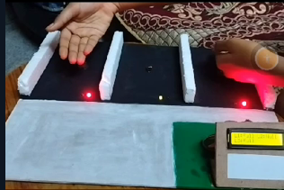
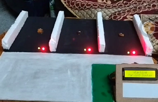

# Smart-Parking-System
Smart parking system using Arduino, IR sensors, a servo motor, and I2C LCD. It automates vehicle entry/exit, monitors slot availability, and displays real-time info. Ideal for efficient urban parking and embedded systems learning.
# Automatic Car Parking System using Arduino and I2C LCD

This project automates a car parking system using an Arduino Uno, IR sensors, a servo motor, and an I2C LCD display. It detects vehicle entry and exit, manages parking slot availability, and displays real-time information.

## 🔧 Components Used

- Arduino Uno
- 16x2 I2C LCD Display
- IR Sensors (for entry, exit, and parking slots)
- Servo Motor
- Jumper Wires
- Breadboard
- Power Supply

## 🖼️ Wiring Diagram

## 🚀 How It Works

1. **Vehicle Detection**: IR sensors detect vehicles at entry and exit points.
2. **Gate Control**: Servo motor acts as a gate, opening or closing based on vehicle detection.
3. **Slot Management**: IR sensors monitor each parking slot's status.
4. **Display**: The I2C LCD displays available slots and system status.

## 📂 Files

- `car_parking_system.ino`: Arduino source code.
- `wiring_diagram.png`: Visual representation of the circuit.
- `images/`: Photos of the assembled project.

## 📸 Project Images

